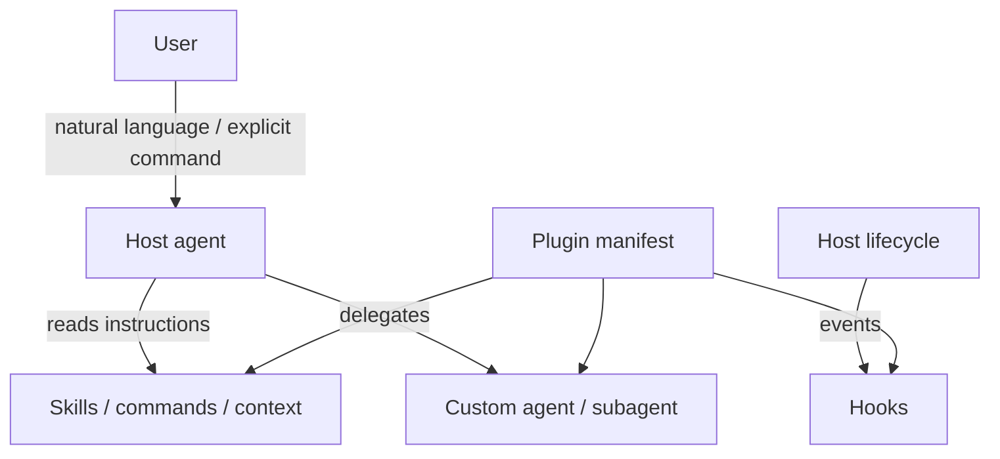
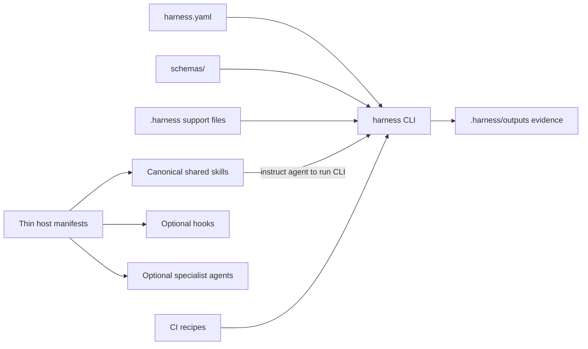

# Research: Agent CLI plugin architecture

## Research question

How should Harness Engineering integrate with agent CLIs such as Claude Code, OpenAI Codex, GitHub Copilot CLI, and Gemini CLI? In particular: should an agent call a Harness plugin, should the plugin call the agent, or should the product be delivered through some other combination of CLI, skills, hooks, plugins, and CI?

## Scope note

MCP was included in the research because it is a major integration primitive in current agent CLIs. It is **not** in scope for this slug's design or implementation. The research uses MCP only to clarify ecosystem architecture and to explain why the scoped design should remain CLI + skills/plugins first.

## Query classification

This is a mixed **technical deep-dive** and **product architecture** question. The technical part is the host integration model used by current agent CLIs; the product part is deciding what Harness Engineering should ship first without creating a second source of truth.

## Executive summary

Modern agent CLIs have converged on a layered integration model: a plugin or extension package declares instruction assets, optional tool integrations, optional hooks, optional specialized agents, and host-specific metadata. The plugin itself is passive; the host agent, host lifecycle, or user invocation triggers its components. Skills can be model-invoked, user-invoked, or both depending on host semantics; hooks are lifecycle-driven; custom commands are mostly user-triggered shortcuts.

For Harness Engineering, the deterministic `harness` CLI, schemas, and JSON outputs should remain the primary machine contract. One canonical shared skill set should teach agents when and how to call the CLI and interpret evidence. Host plugins should be thin manifests/wrappers that package that shared skill set for each agent CLI. MCP is out of scope for this slug and should not shape near-term product semantics.

This research also supports a sharper boundary: Harness Engineering should not be its own model runner or agent runtime. The model lives in the host agent CLI or application. Harness receives repository configuration, declared local checks, explicit candidate/evidence artifacts, and generated outputs to validate and summarize.

## Key finding: who invokes what?

| Component | Typical invoker | Product implication |
|---|---|---|
| CLI command | User, CI, or agent shell/tool runner | Best canonical implementation surface; already testable and reproducible. |
| Skill | Agent automatically and/or user explicitly, depending on host | Best first agent UX layer for procedural workflows. |
| Slash/custom command | User | Useful shortcuts, not a complete autonomous agent integration. |
| Hook | Host lifecycle event | Good for guardrails and reminders; risky as a core execution engine. |
| Subagent/custom agent | User selection or main-agent delegation | Useful specialist UX, but should not own state or rules. |
| MCP tool | Agent/model tool loop | Important ecosystem context, but out of scope for this slug. |

## OpenAI Codex

OpenAI Codex has a first-class plugin system. A plugin is an installable distribution unit rooted at `.codex-plugin/plugin.json` and can bundle skills, app connectors, MCP server configs, hooks, and assets.[^codex-plugins][^codex-build]

Codex plugins are invoked by Codex rather than actively calling Codex. Users can explicitly invoke plugins or bundled skills, and Codex can implicitly match a task description to installed skills.[^codex-plugins][^codex-skills] Skills use `SKILL.md` and may include `agents/openai.yaml`, including policy fields such as `allow_implicit_invocation: false` to prevent automatic model invocation for sensitive workflows.[^codex-skills]

Codex also supports plugin-bundled hooks for lifecycle events such as `SessionStart`, `SubagentStart`, `PreToolUse`, `PostToolUse`, `PermissionRequest`, `UserPromptSubmit`, `PreCompact`, `PostCompact`, `SubagentStop`, and `Stop`.[^codex-hooks] Plugin hooks are trust-sensitive: non-managed hooks require explicit review/trust before execution, which makes them unsuitable as the hidden primary execution path for Harness behavior.[^codex-hooks]

Codex plugin distribution uses marketplace metadata catalogs, including repo-scoped and user-scoped catalogs. Official self-serve public plugin publishing was described as coming soon in the researched docs, so public marketplace availability should not be promised until verified again.[^codex-build]

### Codex implication

For Codex, the best in-scope Harness artifact is a plugin adapter that bundles CLI-oriented skills plus an optional read-only SessionStart hook that detects `harness.yaml`. Codex tool-server features are noted but not part of this slug.

## Claude Code

Claude Code has a mature plugin architecture rooted at `.claude-plugin/plugin.json`. A plugin can bundle skills, legacy command files, agents, hooks, `.mcp.json`, `.lsp.json`, monitors, themes, `bin/`, and default settings.[^claude-plugins][^claude-reference]

Claude Code skills are especially relevant because they directly answer the invocation question. By default, a skill can be invoked by the user and by Claude when its description matches the current task. `disable-model-invocation: true` makes a skill user-only, while `user-invocable: false` makes it Claude-only.[^claude-skills] This maps well to Harness: read-only workflows such as `doctor`, `assess`, and `profile` can be model-invoked, while consequential workflows such as local health execution or repair should require explicit user intent.

Plugin agents can be used as specialized subagents, but plugin agents have security restrictions and should remain adapters rather than engines.[^claude-reference][^claude-subagents]

Hooks are deterministic lifecycle handlers with events such as `SessionStart`, `PreToolUse`, `PostToolUse`, `FileChanged`, `SubagentStart`, and many others.[^claude-hooks] For Harness, hooks are useful as guardrails such as "after editing `harness.yaml`, suggest running `harness doctor --format json`"; they should not silently run broad checks or mutate evidence.

### Claude Code implication

For Claude Code, a full plugin can be valuable, but the scoped first version should be skill + CLI first: skills that instruct Claude how to run the `harness` CLI, a read-only specialist subagent for review, and optional hooks that remind or gate. Tool-server integration is not in scope for this slug.

## GitHub Copilot CLI

GitHub Copilot CLI plugins are directory-based packages with a root `plugin.json`. They can contain custom agents, skills, hooks, MCP server configs, and LSP server configs.[^copilot-plugins][^copilot-create]

Custom agents can be invoked by users through agent selection syntax or flags, and can also be used as subagents by the main agent depending on context.[^copilot-agents] Skills are loaded by the agent when relevant; they are better viewed as instruction/context packages than as ordinary CLI commands.[^copilot-skills]

Hooks run on lifecycle events, and `preToolUse` can approve or deny tool execution, making it a useful guardrail layer.[^copilot-hooks] Plugins can be installed from marketplaces, GitHub repositories, repo subdirectories, Git URLs, or local paths; built-in marketplaces include `github/copilot-plugins` and `github/awesome-copilot`.[^copilot-plugin-reference]

### Copilot CLI implication

For Copilot CLI, this slug should ship a thin plugin that bundles a harness-focused custom agent and canonical shared skills. GitHub Actions/checks remain complementary CI evidence, not the primary in-agent plugin surface.

## Google Gemini CLI

Gemini CLI uses extensions with a `gemini-extension.json` manifest. Extensions can bundle tool integrations, custom commands, a `GEMINI.md` context file, skills, hooks, policies, subagents, and themes.[^gemini-extensions][^gemini-writing]

Custom commands are user-invoked shortcuts, while `GEMINI.md` is context injected by the CLI. Gemini also has a policy engine controlling `allow`, `deny`, and `ask_user` decisions, and extension environment handling is security-relevant: extensions do not receive arbitrary shell environment by default, and needed env vars must be declared through extension settings.[^gemini-writing]

### Gemini implication

For Gemini, the scoped design should focus on `GEMINI.md` context, skills, custom commands, and policies that direct the agent to call the CLI. Tool-server integration is research context only.

## Ecosystem convergence

Across the researched systems, the scoped pattern is:

The "plugin calls the agent" framing is generally wrong. The plugin is the package and declaration surface; the agent invokes plugin-provided instructions or agents, the host invokes plugin hooks, and users invoke plugin commands/agents where supported.

## Design implications for Harness Engineering

The most robust in-scope design is:

The CLI should be the primary machine API. It already provides deterministic behavior, schema validation, JSON outputs, file outputs, and CI testability. Standardizing `--format json` and output artifacts is lower risk than introducing a separate tool server as the first structured interface.

It also means existing runner/model surfaces in the current repository are design debt. They made sense while proving a harness loop with deterministic stubs, but they no longer match the target product boundary. The target design should remove default model profiles, agent runners, live-runner readiness, and any CLI semantics that imply Harness itself calls a model.

## Recommended product decision

Use this rule:

> Harness Engineering exposes a deterministic CLI with schema-backed JSON outputs as the primary machine API. Harness does not own model execution or agent runners. This slug should remove runner/model surfaces, harden current CLI JSON outputs, then ship canonical shared skills and thin host manifests as adapters over that CLI/schema contract. MCP is out of scope and must not define product semantics.

Implementation should be interface-first, but JSON Schemas remain canonical. `biome.json` already enforces repository-wide naming rules: TypeScript interfaces must use an `I` prefix plus PascalCase (`IXxxxXxxx`), generic type parameters must use a `T` prefix plus PascalCase (`TXxxxXxxx`), enums and enum members must use PascalCase, private class members must use `_`-prefixed camelCase, and source file names must use kebab-case. The implementation must satisfy these rules and must not weaken them in `biome.json`. Existing non-conforming names must be migrated through rename-only cleanup slices landed *before* runner/model cleanup, so the cleanup work does not have to fight lint failures unrelated to its purpose.

## Recommended delivery sequence

This ordering is planning-slug guidance only. Do not copy numbered delivery headers into public docs, code, schemas, examples, fixtures, or tests.

### 1. Interface naming cleanup

- Bring existing TypeScript interfaces into compliance with the already-enforced Biome `I*` naming rule through rename-only slices.
- Land this before behavior cleanup so runner/model deletion does not also fight unrelated lint failures.

### 2. Runner/model cleanup inventory and implementation

- Inventory `model_profiles`, `agent_runners`, model-profile/agent-runner schemas, runner readiness, deterministic stub runner examples, provider-backed runner language, and `harness run` semantics.
- Decide whether each surface is deleted or renamed into evidence-import/evidence-verification behavior.
- Remove runner/model concepts before writing plugin or skill implementation.

### 3. CLI JSON inventory and contract hardening

- Ensure every relevant command supports stable JSON output.
- Inventory current JSON shapes, status vocabularies, schema coverage, provenance fields, issue formats, and evidence/artifact references.
- Derive shared JSON contract fields from that inventory.
- Use `issues` as the canonical machine-readable failure field.
- Do not add `next_actions`; skills derive guidance from evidence instead of a CLI-emitted workflow engine.
- Keep `harness.yaml`, schemas, and CLI behavior as the only source of truth.

### 4. Canonical shared skills

After cleanup and JSON contract hardening, this slug can ship host-agnostic skill content:

- `harness-quickstart`
- `harness-doctor`
- `harness-health`
- `harness-assess`
- `harness-evidence-loop`
- `harness-gc-review`
- `harness-profile`

`harness-validate` is intentionally not a shared skill because `validate` remains a human-facing sanity check without JSON output; agents should use `harness doctor --format json` for structural inspection. `harness-evidence-import` is intentionally out of scope; if batch import becomes necessary, it needs a separate substrate contract.

### 5. Thin host manifests and installation evidence

After shared skills exist, this slug can package or reference the same portable skills for host-specific install/discovery:

| Host | Adapter contents |
|---|---|
| Claude Code | Manifest, shared skills, optional read-only subagent, optional reminder hooks |
| GitHub Copilot CLI | Manifest, custom agent, shared skills, optional hooks |
| Codex | Manifest, shared skills, `agents/openai.yaml`, optional read-only hook |
| Gemini CLI | Manifest, `GEMINI.md`, shared skills, custom commands, policies |

### 6. CI remains complementary

CI recipes and GitHub Actions should continue to call the CLI directly and upload `.harness/outputs/**` evidence. CI should not become a plugin-specific source of truth.

## Decision matrix

| Need | Best in-scope surface | Why |
|---|---|---|
| Deterministic implementation | CLI | Testable, CI-friendly, source-of-truth aligned |
| Agent knows when/how to use Harness | Skill | Procedural guidance, low maintenance; adapter over the CLI contract |
| Host-native install/discovery | Thin plugin/extension manifest | Packaging/distribution only; adapter over canonical skills |
| User shortcuts | Host commands/skills | Explicit user-triggered flow |
| Automatic validation reminder | Hook | Event-driven guardrail |
| Continuous enforcement | CI | Evidence automation outside agent loop |

## Risks

| Risk | Mitigation |
|---|---|
| Plugin logic drifts from CLI | Make plugins call CLI only; no duplicate rules. |
| Host adapters fork shared workflow text | Keep one canonical skill source and generate/check packaged copies. |
| Interface naming stays inconsistent | Biome `useNamingConvention` already enforces repository-wide `IXxxxXxxx` interfaces; rename existing interfaces in atomic rename-only cleanup slices and never weaken the Biome rule. |
| JSON contract is invented top-down | Inventory current command outputs first and derive the shared contract from schemas and fixtures. |
| Skills auto-trigger consequential commands | Mark dangerous skills user-only where host supports it. |
| Host APIs evolve quickly | Keep core portable; isolate host specifics in `plugins/<host>/`. |
| Users confuse generated evidence with config | Continue `.harness/outputs/**` separation and docs. |

## Non-goals

- Do not make a host plugin the canonical implementation.
- Do not store independent product state in plugin, skill, hook, or CI layers.
- Do not maintain separate host-specific workflow copies for the same skill.
- Do not implement MCP in this slug.
- Do not implement skills or host manifests in this slug before runner/model cleanup and JSON contract hardening are complete.
- Do not run live models or external APIs without explicit credentials, budgets, and trust boundaries.
- Do not promise marketplace installability until the package and host adapter have shipped evidence.

## Confidence assessment

High confidence:

- Modern agent CLIs use passive plugin packages plus active agent/user/host invocation.
- Skills are the better first layer for Harness workflow guidance.
- CLI JSON contracts are sufficient for structured local automation.

Medium confidence:

- Exact marketplace publishing paths may change, especially for Codex public self-serve publishing and Gemini extension features.
- Host-specific fields for skills and agents should be rechecked immediately before implementation.

Low confidence:

- Enterprise-managed rollout details vary by host and should be validated per adapter.

## Footnotes

[^codex-plugins]: OpenAI Codex plugin docs, "Install and use plugins" and plugin directory sections: https://developers.openai.com/codex/plugins
[^codex-build]: OpenAI Codex build plugin docs, "Plugin structure", "Marketplace metadata", and "Publish official public plugins": https://developers.openai.com/codex/plugins/build
[^codex-skills]: OpenAI Codex Skills docs, "Skill discovery", `agents/openai.yaml`, and implicit invocation policy sections: https://developers.openai.com/codex/skills
[^codex-hooks]: OpenAI Codex Hooks docs, lifecycle events and hook trust/managed hook sections: https://developers.openai.com/codex/hooks
[^claude-plugins]: Claude Code plugin docs, plugin structure and plugin component sections: https://code.claude.com/docs/en/plugins
[^claude-reference]: Claude Code plugin reference, manifest schema and plugin component reference: https://code.claude.com/docs/en/plugins-reference
[^claude-skills]: Claude Code Skills docs, "Control who invokes a skill" and skill frontmatter sections: https://code.claude.com/docs/en/skills
[^claude-hooks]: Claude Code Hooks docs, hook lifecycle and handler types: https://code.claude.com/docs/en/hooks
[^claude-subagents]: Claude Code Sub-agents docs, scope and delegation behavior: https://code.claude.com/docs/en/sub-agents
[^copilot-plugins]: GitHub Copilot CLI plugin concepts, "What plugins contain" and plugin overview: https://docs.github.com/en/copilot/concepts/agents/copilot-cli/about-cli-plugins
[^copilot-create]: GitHub Copilot CLI plugin creation docs, plugin structure and `plugin.json`: https://docs.github.com/en/copilot/how-tos/copilot-cli/customize-copilot/plugins-creating
[^copilot-agents]: GitHub Copilot CLI custom agents docs and programmatic reference for agent invocation: https://docs.github.com/en/copilot/concepts/agents/copilot-cli/about-custom-agents
[^copilot-skills]: GitHub Copilot agent skills docs: https://docs.github.com/en/copilot/concepts/agents/about-agent-skills
[^copilot-hooks]: GitHub Copilot hooks docs: https://docs.github.com/en/copilot/concepts/agents/hooks
[^copilot-plugin-reference]: GitHub Copilot CLI plugin reference, install formats, marketplaces, loading order, and file locations: https://docs.github.com/en/copilot/reference/cli-plugin-reference
[^gemini-extensions]: Gemini CLI extension docs, install/manage extensions and gallery behavior: https://geminicli.com/docs/extensions
[^gemini-writing]: Gemini CLI writing extensions docs, `gemini-extension.json`, settings, context, skills, hooks, policies, and environment variable sanitization: https://geminicli.com/docs/extensions/writing-extensions
